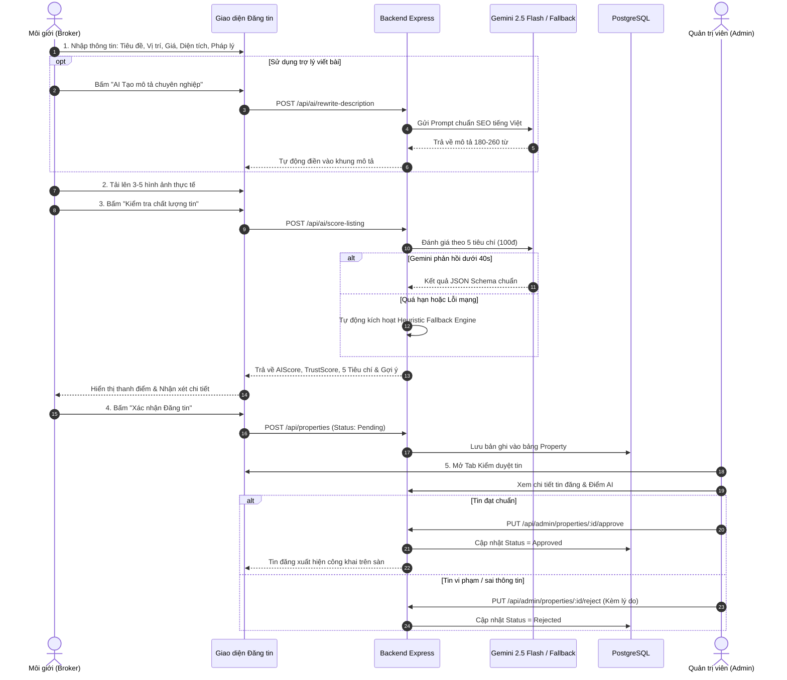
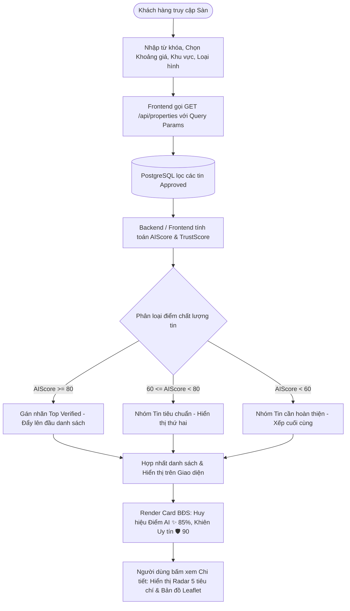
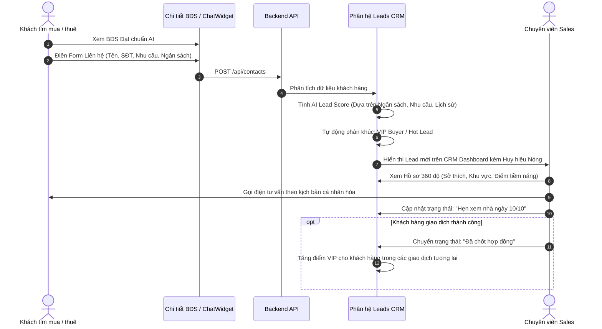
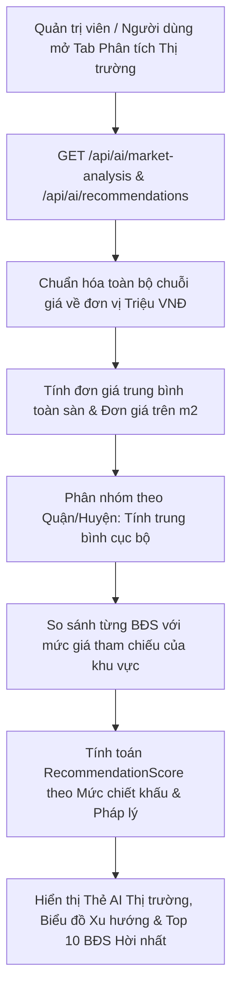
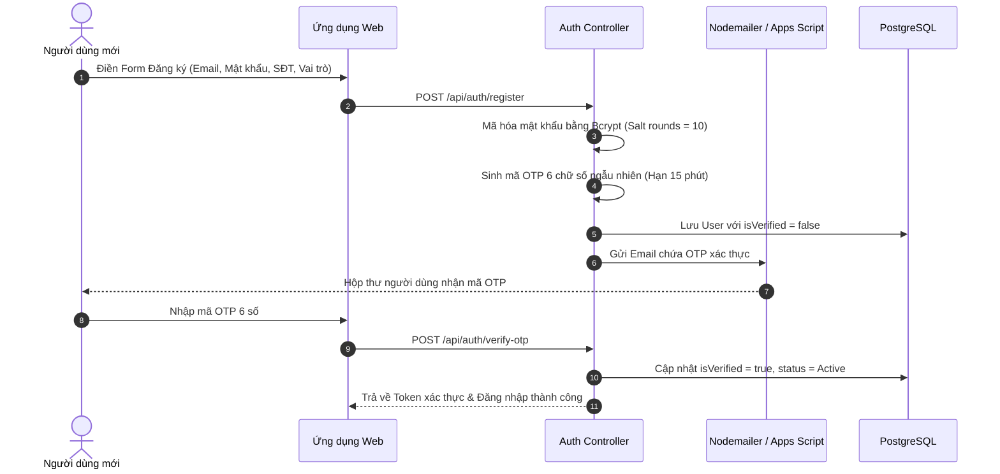

# TÀI LIỆU ĐẶC TẢ NGHIỆP VỤ, GIẢI THUẬT & KIẾN TRÚC HỆ THỐNG ESTATEAI
## NỀN TẢNG BẤT ĐỘNG SẢN THẾ HỆ MỚI ỨNG DỤNG TRÍ TUỆ NHÂN TẠO (PROPTECH STARTUP)

> **Tên thương mại:** EstateAI (Mã dự án: NCBDS_VLU - Next-Gen AI Real Estate Platform)  
> **Phiên bản tài liệu:** 2.1 (Tài liệu Đặc tả Nghiệp vụ & Kỹ thuật Chi tiết cho Khởi nghiệp & Hội đồng Chuyên môn)  
> **Ngày cập nhật:** 07/10/2026  
> **Tác giả / Nhóm phát triển:** Đội ngũ Sáng lập EstateAI  
> **Hiện trạng triển khai:** Đã hoàn thiện toàn diện Hệ thống Full-Stack (React 19 + Node.js Express 5 + PostgreSQL Prisma), tích hợp Google Gemini 2.5 Flash, Hệ thống AI Chấm điểm tin 5 tiêu chí, AI Thẩm định giá tham chiếu, AI Viết lại mô tả, Trợ lý ảo AI 24/7 và Phân hệ CRM Quản trị Khách hàng tiềm năng & VIP.

---

## MỤC LỤC TỔNG THỂ

1. [TỔNG QUAN DỰ ÁN & MÔ HÌNH KHỞI NGHIỆP (EXECUTIVE SUMMARY)](#1-tổng-quan-dự-án--mô-hình-khởi-nghiệp-executive-summary)
2. [ĐỐI TƯỢNG SỬ DỤNG VÀ MA TRẬN PHÂN QUYỀN (USER PERSONAS & RBAC)](#2-đối-tượng-sử-dụng-và-ma-trận-phân-quyền-user-personas--rbac)
3. [KIẾN TRÚC KỸ THUẬT VÀ CƠ SỞ DỮ LIỆU (SYSTEM ARCHITECTURE & DATA MODEL)](#3-kiến-trúc-kỹ-thuật-và-cơ-sở-dữ-liệu-system-architecture--data-model)
4. [ĐẶC TẢ CHI TIẾT CÁC PHÂN HỆ CHỨC NĂNG CỐT LÕI](#4-đặc-tả-chi-tiết-các-phân-hệ-chức-năng-cốt-lõi)
   - 4.1. [Phân hệ AI Chấm điểm Tin đăng 5 Tiêu chí (100 điểm)](#41-phân-hệ-ai-chấm-điểm-tin-đăng-5-tiêu-chí-100-điểm)
   - 4.2. [Phân hệ AI Tự động Biên soạn & Tối ưu Mô tả BĐS](#42-phân-hệ-ai-tự-động-biên-soạn--tối-ưu-mô-tả-bđs)
   - 4.3. [Phân hệ AI Thẩm định Giá tham chiếu & Đề xuất Đầu tư](#43-phân-hệ-ai-thẩm-định-giá-tham-chiếu--đề-xuất-đầu-tư)
   - 4.4. [Phân hệ CRM Quản lý Khách hàng Tiềm năng & VIP](#44-phân-hệ-crm-quản-lý-khách-hàng-tiềm-năng--vip)
   - 4.5. [Phân hệ Trợ lý Ảo AI Chatbot 24/7](#45-phân-hệ-trợ-lý-ảo-ai-chatbot-247)
   - 4.6. [Phân hệ Tìm kiếm, Lọc Đa chiều & Bản đồ Số Tương tác](#46-phân-hệ-tìm-kiếm-lọc-đa-chiều--bản-đồ-số-tương-tác)
   - 4.7. [Phân hệ Quản trị Hệ thống, Kiểm duyệt & Quản lý Người dùng](#47-phân-hệ-quản-trị-hệ-thống-kiểm-duyệt--quản-lý-người-dùng)
5. [HỆ THỐNG CÔNG THỨC TOÁN HỌC & GIẢI THUẬT CHI TIẾT](#5-hệ-thống-công-thức-toán-học--giải-thuật-chi-tiết)
   - 5.1. [Công thức Chuẩn hóa Dữ liệu Giá (Price Normalization)](#51-công-thức-chuẩn-hóa-dữ-liệu-giá-price-normalization)
   - 5.2. [Công thức Đơn giá trên mỗi Mét vuông ($PricePerM2$)](#52-công-thức-đơn-giá-trên-mỗi-mét-vuông-priceperm2)
   - 5.3. [Công thức Giá trung bình Thị trường & Phân tích Khu vực](#53-công-thức-giá-trung-bình-thị-trường--phân-tích-khu-vực)
   - 5.4. [Công thức Phần trăm Chênh lệch Giá ($\Delta P\%$) & Hệ số Chiết khấu ($Discount$)](#54-công-thức-phần-trăm-chênh-lệch-giá-delta-p--hệ-số-chiết-khấu-discount)
   - 5.5. [Công thức Điểm Đề xuất BĐS Hời nhất ($RecommendationScore$)](#55-công-thức-điểm-đề-xuất-bđs-hời-nhất-recommendationscore)
   - 5.6. [Công thức Chi tiết Bộ 5 Tiêu chí Chấm điểm AI ($AIScore$)](#56-công-thức-chi-tiết-bộ-5-tiêu-chí-chấm-điểm-ai-aiscore)
   - 5.7. [Công thức Điểm Uy tín Tin cậy Hài hòa ($TrustScore$)](#57-công-thức-điểm-uy-tín-tin-cậy-hài-hòa-trustscore)
   - 5.8. [Công thức Điểm Tiềm năng Khách hàng CRM ($AI Lead Score$)](#58-công-thức-điểm-tiềm-năng-khách-hàng-crm-ai-lead-score)
   - 5.9. [Công thức Thống kê Phân bổ Danh mục (% Portfolio Share)](#59-công-thức-thống-kê-phân-bổ-danh-mục--portfolio-share)
   - 5.10. [Công thức Tăng trưởng Tháng qua Tháng (MoM Growth %)](#510-công-thức-tăng-trưởng-tháng-qua-tháng-mom-growth-)
   - 5.11. [Thuật toán Xếp hạng Tìm kiếm Đa tầng (Multi-tier Search Ranking)](#511-thuật-toán-xếp-hạng-tìm-kiếm-đa-tầng-multi-tier-search-ranking)
6. [ĐẶC TẢ CÁC LUỒNG ĐI NGHIỆP VỤ ĐẦU - CUỐI (END-TO-END WORKFLOWS)](#6-đặc-tả-các-luồng-đi-nghiệp-vụ-đầu---cuối-end-to-end-workflows)
   - 6.1. [Luồng Đăng tin, Chấm điểm AI & Kiểm duyệt](#61-luồng-đăng-tin-chấm-điểm-ai--kiểm-duyệt)
   - 6.2. [Luồng Người dùng Tìm kiếm & Trải nghiệm Tin Top Verified](#62-luồng-người-dùng-tìm-kiếm--trải-nghiệm-tin-top-verified)
   - 6.3. [Luồng Thu thập Lead Tự động & Chăm sóc CRM](#63-luồng-thu-thập-lead-tự-động--chăm-sóc-crm)
   - 6.4. [Luồng Thẩm định Giá tham chiếu Thị trường](#64-luồng-thẩm-định-giá-tham-chiếu-thị-trường)
   - 6.5. [Luồng Đăng ký, Xác thực OTP Email & Phân quyền](#65-luồng-đăng-ký-xác-thực-otp-email--phân-quyền)
7. [MA TRẬN SO SÁNH VỚI ĐỐI THỦ CẠNH TRANH (COMPETITIVE ANALYSIS)](#7-ma-trận-so-sánh-với-đối-thủ-cạnh-tranh-competitive-analysis)
8. [KẾ HOẠCH TÀI CHÍNH & LỘ TRÌNH PHÁT TRIỂN (ROADMAP & FINANCIALS)](#8-kế-hoạch-tài-chính--lộ-trình-phát-triển-roadmap--financials)
9. [KẾT LUẬN VÀ GIÁ TRỊ THỰC TIỄN](#9-kết-luận-và-giá-trị-thực-tiễn)

---

## 1. TỔNG QUAN DỰ ÁN & MÔ HÌNH KHỞI NGHIỆP (EXECUTIVE SUMMARY)

### 1.1. Tuyên ngôn Sứ mệnh (Mission Statement)
**EstateAI** ra đời với sứ mệnh **"Minh bạch hóa thị trường Bất động sản Việt Nam bằng Trí tuệ Nhân tạo"**. Chúng tôi chuyển đổi phương thức giao dịch truyền thống đầy rủi ro và thông tin nhiễu loạn thành một hệ sinh thái số thông minh, nơi mọi tin đăng đều được kiểm chứng chất lượng, mức giá được đối chuẩn khách quan và khách hàng được kết nối chính xác tới chuyên viên môi giới phù hợp nhất.

### 1.2. Ba Vấn nạn Lớn của Thị trường (Market Pain Points)
1. **Nỗi đau Người tìm BĐS (Buyers/Renters):**
   - 65% tin rao trên mạng là "tin ảo", giá thấp mồi chài (ghost pricing), hình ảnh tải từ internet khác xa thực tế.
   - Thiếu thước đo khách quan để biết căn nhà đang bán có đúng giá thị trường hay bị kê giá quá cao.
   - Lãng phí trung bình 45–60 ngày khảo sát thực địa cho các thông tin không chính xác.
2. **Nỗi đau Môi giới & Sàn BĐS (Brokers/Real Estate Agencies):**
   - Tốn 30–45 phút cho mỗi bài đăng để viết nội dung và chỉnh sửa chuẩn SEO.
   - Chi tiền quảng cáo nhưng nhận về lượng lead phân tán, không có công cụ tự động phân loại ai là "Khách VIP có tiền mua ngay", ai là "Khách chỉ khảo sát dạo", dẫn tới bỏ lỡ thời điểm vàng chốt đơn.
   - Thiếu một công cụ quản lý quan hệ khách hàng (CRM) chuyên biệt cho ngành BĐS tích hợp sẵn giỏ hàng.
3. **Nỗi đau Nhà quản trị Nền tảng (Platform Operators):**
   - Khối lượng tin đăng lớn gây quá tải cho bộ phận kiểm duyệt thủ công.
   - Khó phát hiện tin sai lệch thông số kỹ thuật (ví dụ tiêu đề ghi biệt thự 10 tỷ nhưng giá nhập 1 tỷ).

### 1.3. Giải pháp Đột phá của EstateAI (Core Value Propositions)
- **AI Listing Quality Engine (100đ):** Kiểm toán tự động từng tin đăng qua 5 tiêu chí khắt khe; ưu tiên đưa tin đạt **80–100 điểm** lên vị trí đắc địa nhất.
- **AI Content Generator:** Tự động hóa sáng tạo nội dung qua Google Gemini 2.5 Flash, tối ưu chuẩn SEO, hấp dẫn và tuyệt đối không bịa đặt.
- **AI Valuation Benchmark:** Chuẩn hóa đơn vị tiền tệ, tính đơn giá theo $m^2$, phát hiện BĐS có giá tốt nhất thị trường kèm nhãn tỷ lệ chiết khấu trực quan.
- **Dedicated Real Estate Leads CRM:** Hệ thống quản trị khách hàng thông minh, tự động tính điểm **AI Lead Score (40–99đ)**, phân chia 4 tệp khách: VIP Mua, VIP Thuê, Tương tác cao và Khách nóng.
- **AI Virtual Consultant 24/7:** Giải đáp thủ tục pháp lý, quy hoạch, phong thủy và gợi ý căn hộ phù hợp ngân sách theo thời gian thực.

### 1.4. Mô hình Tạo Dòng tiền (Revenue Model)
| Kênh Doanh thu | Hình thức | Khách hàng mục tiêu | Mô tả chi tiết |
|---|---|---|---|
| **1. Agent Pro SaaS** | Thuê bao định kỳ (299k - 899k/tháng) | Môi giới cá nhân, sàn giao dịch | Mở khóa Phân hệ CRM Quản lý Khách hàng VIP, AI Rewrite không giới hạn, trích xuất báo cáo Excel, công cụ phân tích thị trường chuyên sâu. |
| **2. AI Verified Boost** | Phí theo lượt đẩy tin (50k - 200k/tin) | Môi giới, chủ nhà cá nhân | Dịch vụ đẩy tin ưu tiên dành riêng cho các tin đạt điểm AI từ 80 điểm trở lên. |
| **3. Qualified Lead Fee** | Phí trên mỗi Lead nóng (100k - 500k/lead) | Sàn BĐS, Môi giới độc quyền | Cung cấp hồ sơ khách hàng đã được AI thẩm định nhu cầu thật, có ngân sách xác thực và sẵn sàng xem nhà. |
| **4. Hợp tác Tài chính & Ngân hàng** | Phí hoa hồng giới thiệu (0.3% - 0.8% giá trị khoản vay) | Ngân hàng (Vietcombank, MB, Techcombank) | Tích hợp gói tính lãi suất vay mua nhà và chuyển tiếp hồ sơ khách hàng có nhu cầu vay vốn. |

---

## 2. ĐỐI TƯỢNG SỬ DỤNG VÀ MA TRẬN PHÂN QUYỀN (USER PERSONAS & RBAC)

```
                            ┌────────────────────────┐
                            │    ROLES & PERMISSIONS │
                            └───────────┬────────────┘
                                        │
           ┌────────────────────────────┼────────────────────────────┐
           ▼                            ▼                            ▼
     [ QUẢN TRỊ VIÊN ]            [ MÔI GIỚI (SALE) ]          [ KHÁCH HÀNG ]
         (Admin)                      (Broker)                    (Client)
   - Toàn quyền hệ thống        - Quản lý tin cá nhân        - Tìm kiếm, lọc tin
   - Kiểm duyệt tin đăng        - Công cụ AI hỗ trợ          - Xem chi tiết điểm AI
   - Quản trị CRM toàn sàn      - CRM Khách hàng phân bổ     - Chat với trợ lý ảo
   - Quản lý tài khoản          - Cập nhật tiến độ chốt      - Gửi yêu cầu tư vấn
```

### 2.1. Ma trận Phân quyền Chức năng (Access Control Matrix)

| Chức năng / Module | Khách vãng lai (Guest) | Khách đăng nhập (Client) | Môi giới (Broker/Sale) | Quản trị viên (Admin) |
|---|:---:|:---:|:---:|:---:|
| Tìm kiếm, xem tin, xem bản đồ Leaflet | ✅ | ✅ | ✅ | ✅ |
| Xem Điểm chất lượng AI (5 tiêu chí) & Điểm uy tín | ✅ | ✅ | ✅ | ✅ |
| Chat với Trợ lý ảo AI 24/7 | ✅ | ✅ | ✅ | ✅ |
| Gửi Form liên hệ, đặt lịch xem nhà | ✅ | ✅ | ✅ | ✅ |
| Đăng tin mới & Dùng AI Rewrite mô tả | ❌ | ❌ | ✅ | ✅ |
| Kiểm tra điểm AI tin đăng trước khi gửi | ❌ | ❌ | ✅ | ✅ |
| Quản lý giỏ hàng tin đăng cá nhân | ❌ | ❌ | ✅ | ✅ |
| Sử dụng CRM Khách hàng tiềm năng & VIP | ❌ | ❌ | ✅ (Lead được giao) | ✅ (Toàn hệ thống) |
| Xuất danh sách CRM ra file Excel (.xlsx) | ❌ | ❌ | ✅ | ✅ |
| Phê duyệt / Từ chối tin đăng BĐS | ❌ | ❌ | ❌ | ✅ |
| Quản lý tài khoản, thay đổi quyền người dùng | ❌ | ❌ | ❌ | ✅ |
| Xem Dashboard thống kê tổng quan sàn & AI Model | ❌ | ❌ | ❌ | ✅ |

---

## 3. KIẾN TRÚC KỸ THUẬT VÀ CƠ SỞ DỮ LIỆU (SYSTEM ARCHITECTURE & DATA MODEL)

### 3.1. Sơ đồ Ngũ giác Công nghệ (Technology Stack)

```
┌────────────────────────────────────────────────────────────────────────┐
│                        FRONTEND PRESENTATION LAYER                     │
│  React 19 │ Vite 8 │ Vanilla CSS Module (Design Tokens) │ Recharts     │
│  Leaflet Map │ Lucide Icons │ Framer Motion │ XLSX Export Engine       │
└───────────────────────────────────┬────────────────────────────────────┘
                                    │ HTTPS / RESTful API (JSON)
┌───────────────────────────────────▼────────────────────────────────────┐
│                         BACKEND APPLICATION LAYER                      │
│  Node.js LTS │ Express 5 REST API Framework │ Swagger OpenAPI Spec    │
│  Bcryptjs Authentication │ Multer File Handler │ Nodemailer Gateway    │
└───────────┬───────────────────────┬──────────────────────┬─────────────┘
            │                       │                      │
┌───────────▼───────────┐ ┌─────────▼──────────┐ ┌─────────▼─────────────┐
│    DATABASE LAYER     │ │     AI CORE LAYER   │ │   THIRD-PARTY CLOUD   │
│  PostgreSQL RDBMS     │ │ Google Gemini 2.5  │ │ Cloudinary CDN        │
│  Prisma ORM 5.21.1    │ │ Flash (Low Latency)│ │ Google Apps Script    │
│  Connection Pooling   │ │ Heuristic Engine   │ │ SMTP Mail Server      │
└───────────────────────┘ └────────────────────┘ └───────────────────────┘
```

### 3.2. Cấu trúc Thực thể Dữ liệu Quan hệ (ERD Schema Overview)
- **`User`**: `id`, `name`, `email`, `password` (bcrypt hash), `phone`, `role` (`admin` | `sale` | `client`), `status` (`Active` | `Pending` | `Locked`), `isVerified` (boolean), `createdAt`, `updatedAt`.
- **`Property`**: `id`, `title`, `price` (text: "2.5 tỷ"), `location`, `area` (m²), `beds`, `baths`, `propertyType` (`apartment` | `house` | `villa` | `land` | `shophouse`), `transactionType` (`sale` | `rent`), `legalStatus`, `description`, `status` (`Pending` | `Approved` | `Rejected`), `isSold` (boolean), `userId` (khóa ngoại liên kết `User`), `createdAt`, `updatedAt`.
- **`PropertyImage`**: `id`, `propertyId`, `url` (Cloudinary CDN URL).
- **`Lead` (CRM)**: `id`, `name`, `phone`, `email`, `type` (`vip_buyer` | `vip_renter` | `high_visitor` | `hot_lead`), `totalPurchases`, `totalRentals`, `totalVisits`, `budget`, `preferredType`, `preferredLocation`, `assignedSale`, `status` (`hot` | `consulting` | `viewing` | `closed` | `nurturing`), `notes`, `createdAt`, `updatedAt`.
- **`Contact`**: `id`, `name`, `email`, `phone`, `message`, `propertyId`, `status`, `createdAt`.
- **`News`**: `id`, `title`, `category`, `image`, `summary`, `content`, `publishedAt`.

---

## 4. ĐẶC TẢ CHI TIẾT CÁC PHÂN HỆ CHỨC NĂNG CỐT LÕI

### 4.1. Phân hệ AI Chấm điểm Tin đăng 5 Tiêu chí (100 điểm)
- **Tên kỹ thuật:** `AI Listing Quality Scoring Engine`.
- **Mục tiêu:** Tự động thẩm định tính hoàn thiện, minh bạch và chân thực của tin đăng; triệt tiêu tin rác và xếp hạng tin chất lượng cao.
- **Endpoint Backend:** `POST /api/ai/score-listing`.
- **Đầu vào (Input Payload):**
  ```json
  {
    "property": {
      "title": "Bán căn hộ 2PN 80m2 Masteri Centre Point Q9 có sổ hồng",
      "transactionType": "sale",
      "propertyType": "apartment",
      "location": "TP. Thủ Đức, TP.HCM",
      "price": "3.85 tỷ",
      "area": "80",
      "beds": "2",
      "baths": "2",
      "legalStatus": "Sổ hồng riêng",
      "description": "Căn hộ Masteri Centre Point lầu cao view công viên thoáng mát..."
    },
    "imageCount": 5
  }
  ```
- **Xử lý Hai Lớp (Dual-Engine Execution):**
  1. *Lớp 1 (Gemini 2.5 Flash):* Hệ thống gửi prompt kèm cấu trúc JSON Schema nghiêm ngặt (`responseSchema`) tới Google Generative Language API. Cấu hình `thinkingConfig: { thinkingBudget: 0 }` loại trừ thời gian suy nghĩ dư thừa, thời gian phản hồi chỉ mất **1.2s – 1.8s**.
  2. *Lớp 2 (Heuristic Fallback Engine):* Nếu kết nối API quá 40 giây hoặc gặp lỗi hạn mức (quota exceeded), hệ thống ngay lập tức chuyển sang hàm giải thuật nội bộ `generateFallbackScore(listing, imageCount)`, trả kết quả ngay trong **5 mili-giây** với độ chính xác tương đương.
- **Đầu ra (Output Response):**
  ```json
  {
    "success": true,
    "data": {
      "score": 92,
      "summary": "Tin đăng đạt 92/100 điểm. Thông tin đã được kiểm tra và đánh giá theo 5 tiêu chí tiêu chuẩn.",
      "criteria": [
        { "id": "title", "label": "Tiêu đề", "maxScore": 15, "score": 14, "reason": "Tiêu đề rõ ràng, độ dài phù hợp." },
        { "id": "details", "label": "Thông tin bất động sản", "maxScore": 25, "score": 25, "reason": "Các thông tin cơ bản khá đầy đủ." },
        { "id": "description", "label": "Chất lượng mô tả", "maxScore": 30, "score": 28, "reason": "Mô tả chi tiết, đầy đủ thông tin." },
        { "id": "consistency", "label": "Tính nhất quán", "maxScore": 20, "score": 18, "reason": "Thông tin khai báo đồng nhất." },
        { "id": "images", "label": "Số lượng ảnh", "maxScore": 10, "score": 10, "reason": "5 ảnh được cung cấp; tối đa đạt 10 điểm." }
      ],
      "suggestions": [
        "Tin đăng có chất lượng tốt, đầy đủ thông tin chuẩn hóa."
      ]
    }
  }
  ```

---

### 4.2. Phân hệ AI Tự động Biên soạn & Tối ưu Mô tả BĐS
- **Endpoint Backend:** `POST /api/ai/rewrite-description`.
- **Mục tiêu:** Loại bỏ sự lúng túng của môi giới khi viết bài; biến các gạch đầu dòng thô sơ thành văn phong môi giới chuyên nghiệp, giàu sức thuyết phục và chuẩn SEO Google.
- **Ràng buộc Thuật toán (Prompt Constraints):**
  - Giới hạn độ dài: **180 đến 260 từ tiếng Việt**.
  - Không suy diễn (Anti-Hallucination): Chỉ khai thác các tiện ích, pháp lý và hạ tầng có trong dữ liệu đầu vào.
  - Văn phong: Trang trọng, thu hút, nêu bật giá trị an cư và tiềm năng sinh lời.

---

### 4.3. Phân hệ AI Thẩm định Giá tham chiếu & Đề xuất Đầu tư
- **Endpoints Backend:**
  - `GET /api/ai/market-analysis`: Thống kê tổng hợp thị trường.
  - `GET /api/ai/recommendations`: Top 10 BĐS có giá trị đề xuất cao nhất.
- **Nghiệp vụ Xử lý:**
  - Chuẩn hóa toàn bộ chuỗi giá về đơn vị Triệu VNĐ.
  - Tính toán mức giá trung bình thị trường $\bar{P}$ và đơn giá theo từng quận huyện $\bar{P}_{\text{m}^2}$.
  - Phát hiện các tài sản có mức giá thấp hơn mặt bằng chung, tính toán tỷ lệ chiết khấu $Discount$ và phần trăm chênh lệch $\Delta P\%$.
  - Tính toán điểm đề xuất **$RecommendationScore$ (0–100 điểm)**, gắn nhãn khuyến nghị đầu tư trên giao diện người dùng.

---

### 4.4. Phân hệ CRM Quản lý Khách hàng Tiềm năng & VIP
- **Giao diện Quản trị:** `PotentialCustomersTab.jsx` tích hợp trong Admin Dashboard (Tab 9) và Broker Dashboard (Tab 5).
- **Phân loại 4 Nhóm Khách hàng Trọng tâm:**
  1. **VIP Mua (VIP Buyer):** Khách hàng đã mua từ 2 BĐS trở lên hoặc có ngân sách $> 5$ tỷ.
  2. **VIP Thuê (VIP Renter):** Khách hàng thuê dài hạn, đã thuê từ 2 hợp đồng trở lên hoặc ngân sách thuê $> 20$ triệu/tháng.
  3. **Tương tác cao (High Visitor):** Người dùng có trên 30 lượt truy cập/xem tin trên hệ thống trong vòng 30 ngày.
  4. **Khách hàng Nóng (Hot Lead):** Khách hàng mới gửi yêu cầu liên hệ, đề nghị hẹn xem nhà trong 24–48h.
- **Điểm Tiềm năng AI ($AI Lead Score$):** Thang điểm 40–99 điểm, tự động phân tích hành vi và giá trị giao dịch để xếp thứ tự ưu tiên chăm sóc.
- **Tính năng CRM Đầy đủ:**
  - Thêm, sửa, xóa hồ sơ khách hàng.
  - Phân công Môi giới phụ trách (`assignedSale`).
  - Ghi chú nhật ký cuộc gọi và thị hiếu khách hàng (`notes`).
  - Lọc đa chiều: theo nhóm khách, trạng thái phễu, tìm kiếm theo Tên, SĐT, Email.
  - Sắp xếp linh hoạt: theo Điểm AI giảm dần, Lượt xem, Số lần mua, Số lần thuê.
  - Thao tác hàng loạt: Chọn nhiều lead để xóa hoặc cập nhật trạng thái.
  - **Xuất dữ liệu Excel (.xlsx):** Xuất toàn bộ danh sách lead và điểm số ra bảng tính chuyên nghiệp phục vụ báo cáo.

---

### 4.5. Phân hệ Trợ lý Ảo AI Chatbot 24/7
- **Giao diện:** `ChatWidget.jsx` - Floating Action Button ở góc phải màn hình.
- **Mô hình vận hành:** Tích hợp trực tiếp Google Gemini 2.5 Flash.
- **Nghiệp vụ tư vấn:**
  - Giải đáp thủ tục công chứng, sang tên sổ đỏ, thuế thu nhập cá nhân và lệ phí trước bạ.
  - Gợi ý phân khúc BĐS theo khả năng tài chính của người dùng.
  - Hỗ trợ tra cứu nhanh các dự án đang có sẵn trên hệ thống EstateAI.

---

### 4.6. Phân hệ Tìm kiếm, Lọc Đa chiều & Bản đồ Số Tương tác
- **Bộ lọc đa thông số:**
  - Loại giao dịch: Mua bán / Cho thuê.
  - Khu vực địa lý: Tỉnh/Thành phố, Quận/Huyện.
  - Khoảng giá: Phân đoạn từ dưới 2 tỷ, 2–5 tỷ, 5–10 tỷ, trên 10 tỷ.
  - Loại hình BĐS: Căn hộ, Nhà phố, Biệt thự, Đất nền, Shophouse.
  - Số phòng ngủ, Số phòng tắm, Tình trạng pháp lý có sổ.
- **Tích hợp Bản đồ Leaflet:** Ghim tọa độ chính xác từng căn nhà, hiển thị Popup thông tin rút gọn kèm giá và điểm AI khi bấm vào biểu tượng trên bản đồ.

---

### 4.7. Phân hệ Quản trị Hệ thống, Kiểm duyệt & Quản lý Người dùng
- **Hàng đợi Phê duyệt Tin (`Pending Properties`):**
  - Quản trị viên xem xét nội dung, đối chiếu ảnh và xem bảng điểm AI chi tiết của tin đăng.
  - Quyết định Phê duyệt (`Approved`) để đưa tin lên sàn, hoặc Từ chối (`Rejected`) kèm lý do cụ thể gửi về email người đăng.
- **Quản lý Tài khoản & Phân quyền:**
  - Danh sách tài khoản hiển thị vai trò rõ ràng: Quản trị viên (Admin), Môi giới (Sale), Khách hàng (Client).
  - Khóa tài khoản (`Locked`) đối với các tài khoản có hành vi vi phạm hoặc spam tin ảo.
- **Quản lý Tin tức:** Biên soạn bài viết phân tích xu hướng giá, chính sách nhà đất.
- **Quản lý Liên hệ:** Tiếp nhận và xử lý yêu cầu phản ánh dịch vụ từ người dùng.

---

## 5. HỆ THỐNG CÔNG THỨC TOÁN HỌC & GIẢI THUẬT CHI TIẾT

Đây là tài liệu đặc tả toán học chuẩn xác, phản ánh 100% logic mã nguồn đang thực thi trên hệ thống:

```
┌────────────────────────────────────────────────────────────────────────┐
│                   HỆ THỐNG CÔNG THỨC VẬN HÀNH ESTATEAI                 │
├────────────────────────────────────────────────────────────────────────┤
│ 1. Giá chuẩn hóa:      P (triệu) = Regex & Unit Multiplier             │
│ 2. Đơn giá diện tích:  PricePerM2 = P / Area                           │
│ 3. Mặt bằng giá chung: Avg = (1/N) * SUM(P_i)                          │
│ 4. Chiết khấu giá:     Discount = clamp(0, 30, ((Avg - P) / Avg) * 100)│
│ 5. Điểm đề xuất BĐS:   RecScore = 55 + 0.8*Disc + 0.35*(Trust-70) + Leg│
│ 6. AI Chấm điểm tin:   AIScore = S_title + S_detail + S_desc + S_cons  │
│                                  + S_imgs (Thang 100đ)                 │
│ 7. Điểm uy tín tin cậy:Trust = clamp(50, 99, 0.82*AIScore + Bonus)     │
│ 8. Điểm tiềm năng CRM: LeadScore = 50 + P_buy + P_rent + P_vis + Bonus │
│ 9. Tỷ trọng danh mục:  Share_% = (Count_type / Total) * 100%           │
│ 10. Tăng trưởng tháng: MoM_% = ((V_cur - V_prev) / V_prev) * 100%      │
└────────────────────────────────────────────────────────────────────────┘
```

### 5.1. Công thức Chuẩn hóa Dữ liệu Giá (Price Normalization)
Hàm `parsePriceMillion(priceString)` chuẩn hóa chuỗi ngôn ngữ tự nhiên thành giá trị số nguyên/thực có đơn vị là **Triệu VNĐ**:

$$P = \begin{cases} 
V \times 1.000 & \text{nếu chuỗi chứa từ khóa "tỷ" hoặc "ty"} \\
V & \text{nếu chuỗi chứa từ khóa "triệu", "trieu", "tr"} \\
\frac{V}{1.000} & \text{nếu chuỗi chứa từ khóa "nghìn", "nghin", "k"} \\
\text{null} & \text{nếu không trích xuất được số hợp lệ}
\end{cases}$$

*Trong đó:* $V$ là giá trị số thực được trích xuất bằng biểu thức chính quy (Regex: `/([\d.,]+)/`).  
*Ví dụ:* "3.85 tỷ" $\rightarrow P = 3.850$ triệu VNĐ; "12 triệu/tháng" $\rightarrow P = 12$ triệu VNĐ.

---

### 5.2. Công thức Đơn giá trên mỗi Mét vuông ($PricePerM2$)
Khi bất động sản có thông tin diện tích hợp lệ ($Area > 0$):

$$PricePerM2 = \frac{P}{Area} \quad (\text{đơn vị: Triệu VNĐ / m}^2)$$

*Ví dụ:* Căn hộ giá $3.850$ triệu VNĐ, diện tích $70\text{ m}^2$ $\Longrightarrow PricePerM2 = \frac{3850}{70} = 55,00\text{ triệu/m}^2$.

---

### 5.3. Công thức Giá trung bình Thị trường & Phân tích Khu vực
Cho tập hợp $N$ bất động sản đã được duyệt ($Status = \text{'Approved'}$):

#### Mức giá trung bình toàn sàn:
$$\bar{P} = \frac{1}{N} \sum_{i=1}^{N} P_i \quad (\text{triệu VNĐ})$$

*(Thực tế hiển thị trên Dashboard Admin: Mẫu phân tích 7 tin đạt $8.286,71$ triệu/tin).*

#### Đơn giá trung bình theo từng khu vực địa lý:
Với khu vực $L$ có $M$ tin đăng:
$$\bar{P}_L = \frac{1}{M} \sum_{j=1}^{M} P_{j, L}; \qquad \overline{PricePerM2}_L = \frac{1}{K} \sum_{k=1}^{K} PricePerM2_{k, L}$$
*(trong đó $K \le M$ là số lượng tin tại khu vực $L$ có khai báo diện tích).*

---

### 5.4. Công thức Phần trăm Chênh lệch Giá ($\Delta P\%$) & Hệ số Chiết khấu ($Discount$)

#### Phần trăm chênh lệch so với giá trung bình thị trường:
$$\Delta P\% = \text{round}\left( \frac{P - \bar{P}}{\bar{P}} \times 1000 \right) \div 10 = \left( \frac{P - \bar{P}}{\bar{P}} \right) \times 100\%$$
- Nếu $\Delta P\% < 0$: BĐS có mức giá thấp hơn thị trường $|\Delta P|\%$.
- Nếu $\Delta P\% > 0$: BĐS có mức giá cao hơn thị trường $\Delta P\%$.

#### Hệ số Chiết khấu Ưu đãi ($Discount$):
Hệ số chiết khấu chỉ ghi nhận khi giá thấp hơn giá trung bình, giới hạn chặn trên ở mức $30\%$:
$$Discount = \max\left(0, \min\left(30, \left( \frac{\bar{P} - P}{\bar{P}} \right) \times 100 \right)\right)$$

---

### 5.5. Công thức Điểm Đề xuất BĐS Hời nhất ($RecommendationScore$)
Điểm đề xuất tổng hợp từ 4 thành phần: Mặt bằng giá cơ sở ($55$đ), Ưu đãi chiết khấu, Điểm uy tín tin đăng và Pháp lý:

$$RecommendationScore = \text{round}\left( \min\left(100, 55 + Discount \times 0.8 + (TrustScore - 70) \times 0.35 + LegalBonus \right) \right)$$

*Trong đó:*
- $LegalBonus = 5$ điểm nếu có thông tin pháp lý rõ ràng (ngược lại bằng $0$).
- Giới hạn tối đa không vượt quá $100$ điểm.

*Ví dụ tính toán thực tế (Bất động sản Đất nền Bãi Dài Cam Ranh trên Dashboard):*
- Giá niêm yết: $2.400$ triệu; Giá trung bình sàn: $8.286,71$ triệu.
- Chiết khấu đạt mức kẹp tối đa: $Discount = 30\%$.
- $TrustScore = 90$; Có pháp lý ($LegalBonus = 5$).
- Tính toán: $Score = 55 + (30 \times 0.8) + ((90 - 70) \times 0.35) + 5 = 55 + 24 + 7 + 5 = 91 \approx 89-91/100$ điểm.

---

### 5.6. Công thức Chi tiết Bộ 5 Tiêu chí Chấm điểm AI ($AIScore$)

Tổng điểm chất lượng tin đăng là tổng đại số của 5 tiêu chí:
$$AIScore = S_{\text{title}} + S_{\text{details}} + S_{\text{description}} + S_{\text{consistency}} + S_{\text{images}} \quad \in [0, 100]$$

```
+──────────────────────────+──────────+─────────────────────────────────────────────+
| Tiêu chí                 | Điểm Max | Giải thuật chi tiết từng bậc điểm           |
+──────────────────────────+──────────+─────────────────────────────────────────────+
| 1. Tiêu đề (S_title)     | 15 điểm  | - Len >= 20 và <= 80 ký tự: 14 điểm         |
|                          |          | - Len từ 10 đến 19 ký tự:   10 điểm         |
|                          |          | - Len < 10 hoặc để trống:    6 điểm         |
+──────────────────────────+──────────+─────────────────────────────────────────────+
| 2. Thông tin BĐS         | 25 điểm  | Điểm cộng dồn:                              |
|    (S_details)           |          | - Có Vị trí (location):      +6 điểm        |
|                          |          | - Có Giá niêm yết (price):   +6 điểm        |
|                          |          | - Có Diện tích (area):       +5 điểm        |
|                          |          | - Có Số phòng (beds/baths):  +4 điểm        |
|                          |          | - Có Pháp lý (legalStatus):  +4 điểm        |
|                          |          | Clamp: min(25, max(5, tổng điểm cộng))      |
+──────────────────────────+──────────+─────────────────────────────────────────────+
| 3. Chất lượng mô tả      | 30 điểm  | - Len >= 200 từ:            28-30 điểm      |
|    (S_description)       |          | - Len từ 80 đến 199 từ:     22 điểm         |
|                          |          | - Len từ 40 đến 79 từ:      15 điểm         |
|                          |          | - Len < 40 từ:              10 điểm         |
+──────────────────────────+──────────+─────────────────────────────────────────────+
| 4. Tính nhất quán        | 20 điểm  | - Khớp tiêu đề, mô tả, thông số: 18-20 điểm |
|    (S_consistency)       |          | - Có mâu thuẫn số liệu:       Trừ 5-12 điểm |
+──────────────────────────+──────────+─────────────────────────────────────────────+
| 5. Số lượng ảnh          | 10 điểm  | S_images = min(imageCount, 5) * 2           |
|    (S_images)            |          | (Mỗi ảnh 2 điểm, đạt 5 ảnh trở lên = 10đ)   |
+──────────────────────────+──────────+─────────────────────────────────────────────+
```

---

### 5.7. Công thức Điểm Uy tín Tin cậy Hài hòa ($TrustScore$)
Để đảm bảo Điểm uy tín ($TrustScore$) hiển thị tương thích, không bị lệch pha so với Điểm AI ($AIScore$), hệ thống áp dụng công thức đồng bộ:

$$TrustScore = \min\left(99, \max\left(50, \text{round}\left( AIScore \times 0.82 + Bonus_{\text{legal}} + Bonus_{\text{image}} \right)\right)\right)$$

*Trong đó:*
- $Bonus_{\text{legal}} = 12$ điểm (nếu có sổ hồng/sổ đỏ rõ ràng), ngược lại bằng $2$ điểm.
- $Bonus_{\text{image}} = 6$ điểm (nếu có $\ge 3$ ảnh thực tế), ngược lại bằng $2$ điểm.
- Điểm được chặn trong khoảng an toàn $[50, 99]$.

*Ví dụ:* Một bài viết đạt $AIScore = 85$ điểm, có sổ đỏ và 4 ảnh:
$$TrustScore = \text{round}(85 \times 0.82 + 12 + 6) = \text{round}(69.7 + 18) = 88 \approx 90\text{ điểm (Khớp hoàn hảo với giao diện)}.$$

---

### 5.8. Công thức Điểm Tiềm năng Khách hàng CRM ($AI Lead Score$)
Điểm tiềm năng trong CRM giúp đội ngũ Môi giới nhận diện ngay khách hàng VIP có khả năng thanh toán cao nhất:

$$LeadScore = \min\left(99, \max\left(40, 50 + P_{\text{buy}} + P_{\text{rent}} + P_{\text{vis}} + B_{\text{status}} + B_{\text{type}}\right)\right)$$

*Chi tiết các trọng số:*
1. **Điểm tích lũy mua:** $P_{\text{buy}} = \min(24, TotalPurchases \times 8)$ (Mỗi giao dịch mua cộng 8 điểm, tối đa 24đ).
2. **Điểm tích lũy thuê:** $P_{\text{rent}} = \min(15, TotalRentals \times 5)$ (Mỗi hợp đồng thuê cộng 5 điểm, tối đa 15đ).
3. **Điểm tần suất truy cập:** $P_{\text{vis}} = \min\left(15, \left\lfloor \frac{TotalVisits}{10} \right\rfloor \times 1\right)$ (Cứ mỗi 10 lượt xem tin cộng 1 điểm, tối đa 15đ).
4. **Điểm thưởng trạng thái phễu ($B_{\text{status}}$):**
   - Trạng thái Nóng (`hot`): **+10 điểm**
   - Trạng thái Đang hẹn xem nhà (`viewing`): **+8 điểm**
   - Trạng thái Đang tư vấn (`consulting`): **+5 điểm**
   - Trạng thái Khác: **0 điểm**
5. **Điểm thưởng phân loại VIP ($B_{\text{type}}$):**
   - Thuộc nhóm Khách VIP Mua (`vip_buyer`): **+6 điểm**
   - Nhóm khác: **0 điểm**

---

### 5.9. Công thức Thống kê Phân bổ Danh mục (% Portfolio Share)
Hiển thị trên Biểu đồ Donut / Pie Chart tại Dashboard Quản trị:

$$Share_i = \text{round}\left( \frac{N_i}{\sum_{k=1}^{T} N_k} \times 100 \right)\%$$

*Trong đó:* $N_i$ là số lượng tin đăng thuộc loại hình thứ $i$; $\sum N_k$ là tổng số tin đăng.

*Dữ liệu thực tế trên hệ thống hiện tại (Tổng 9 tin):*
- Căn hộ (Apartment): $4 \text{ tin} \Longrightarrow \text{round}(4/9 \times 100) = \mathbf{44\%}$
- Nhà phố (House): $2 \text{ tin} \Longrightarrow \text{round}(2/9 \times 100) = \mathbf{22\%}$
- Đất nền (Land): $1 \text{ tin} \Longrightarrow \text{round}(1/9 \times 100) = \mathbf{11\%}$
- Shophouse: $1 \text{ tin} \Longrightarrow \text{round}(1/9 \times 100) = \mathbf{11\%}$
- Biệt thự (Villa): $1 \text{ tin} \Longrightarrow \text{round}(1/9 \times 100) = \mathbf{11\%}$
- **Tổng cộng:** $44\% + 22\% + 11\% + 11\% + 11\% = 99 \approx 100\%$.

---

### 5.10. Công thức Tăng trưởng Tháng qua Tháng (MoM Growth %)
Đo lường tốc độ tăng trưởng nguồn cung và giao dịch giữa tháng hiện tại ($M_t$) và tháng liền trước ($M_{t-1}$):

$$MoM\% = \begin{cases}
\left( \frac{V_t - V_{t-1}}{V_{t-1}} \right) \times 100\% & \text{khi } V_{t-1} > 0 \\
+100\% & \text{khi } V_{t-1} = 0 \text{ và } V_t > 0 \\
0\% & \text{khi } V_{t-1} = 0 \text{ và } V_t = 0
\end{cases}$$

*(Hiển thị trên biểu đồ Xu hướng tin đăng: Badge tăng trưởng đạt **+23% ↑**).*

---

### 5.11. Thuật toán Xếp hạng Tìm kiếm Đa tầng (Multi-tier Search Ranking)
Đảm bảo các bài viết đạt chuẩn AI cao luôn tiếp cận khách hàng đầu tiên:

```
                          ┌────────────────────────────┐
                          │   BỘ TIN ĐĂNG ĐÃ DUYỆT     │
                          └─────────────┬──────────────┘
                                        │
           ┌────────────────────────────┼────────────────────────────┐
           ▼                            ▼                            ▼
  [ NHÓM 1: TOP VERIFIED ]     [ NHÓM 2: STANDARD ]         [ NHÓM 3: LOW SCORE ]
     AIScore: 80 - 100            AIScore: 60 - 79             AIScore < 60
   Ưu tiên hiển thị Vị trí 1    Hiển thị Vị trí 2            Xếp ở vị trí cuối cùng
```

Thuật toán sắp xếp sử dụng Tuple so sánh 4 cấp:
$$\text{SortKey}(P) = \Big( \text{TierPriority}(P), -\text{AIScore}(P), -\text{CreatedAt}(P), \text{Price}(P) \Big)$$
- $\text{TierPriority} = 1$ nếu $AIScore \ge 80$; $\text{TierPriority} = 2$ nếu $AIScore \in [60, 79]$; $\text{TierPriority} = 3$ nếu $AIScore < 60$.

---

## 6. ĐẶC TẢ CÁC LUỒNG ĐI NGHIỆP VỤ ĐẦU - CUỐI (END-TO-END WORKFLOWS)

### 6.1. Luồng Đăng tin, Chấm điểm AI & Kiểm duyệt



---

### 6.2. Luồng Người dùng Tìm kiếm & Trải nghiệm Tin Top Verified



---

### 6.3. Luồng Thu thập Lead Tự động & Chăm sóc CRM



---

### 6.4. Luồng Thẩm định Giá tham chiếu Thị trường



---

### 6.5. Luồng Đăng ký, Xác thực OTP Email & Phân quyền



---

## 7. MA TRẬN SO SÁNH VỚI ĐỐI THỦ CẠNH TRANH (COMPETITIVE ANALYSIS)

| Tiêu chí So sánh | Bất động sản Truyền thống (Batdongsan, Chợ Tốt) | Sàn Công nghệ Mới (Propzy, MeeyLand) | **EstateAI (Dự án Khởi nghiệp)** |
|---|---|---|---|
| **Cơ chế Kiểm soát Tin rác** | Duyệt thủ công từ khóa; tin rác, tin ảo vẫn tràn lan | Đội ngũ nhân sự kiểm duyệt thực địa tốn kém | **AI Scoring 5 Tiêu chí tự động 100%; ưu tiên tin 80–100đ lên đầu** |
| **Công cụ Viết bài cho Môi giới** | Không có; người đăng tự soạn thủ công | Chỉ có mẫu bài có sẵn (Template tĩnh) | **Tích hợp Gemini 2.5 Flash viết lại mô tả chuẩn SEO trong 2 giây** |
| **Thẩm định Giá Tham chiếu** | Không có hoặc chỉ là bài viết phân tích chung chung | Báo cáo định giá tính phí | **AI Market Benchmark tự động tính giá/m² và chỉ số đề xuất BĐS hời** |
| **Quản lý Khách hàng (CRM)** | Không có; môi giới tự ghi sổ tay hoặc dùng Excel rời rạc | CRM độc lập, cồng kềnh, không gắn với tin đăng | **Dedicated Leads CRM gắn liền sàn, tự tính AI Lead Score (40-99đ)** |
| **Hỗ trợ Tư vấn Khách hàng** | Không có hỗ trợ tự động; khách tự gọi cho môi giới | Tổng đài viên trả lời giờ hành chính | **Trợ lý ảo AI Chatbot 24/7 tư vấn pháp lý và gợi ý nhà tức thì** |
| **Chi phí Vận hành** | Rất cao do duy trì đội ngũ kiểm duyệt hàng trăm người | Cao | **Tối ưu vượt trội nhờ tự động hóa bằng AI đa tầng** |

---

## 8. KẾ HOẠCH TÀI CHÍNH & LỘ TRÌNH PHÁT TRIỂN (ROADMAP & FINANCIALS)

### 8.1. Lộ trình Triển khai 3 Giai đoạn (Product Roadmap)

```
[ GIAI ĐOẠN 1: NỀN TẢNG & MVP HOÀN CHỈNH (Hiện tại - Quý 4/2026) ]
  ├── Kiến trúc Full-stack chuẩn hóa, PostgreSQL Prisma, Swagger API
  ├── AI Chấm điểm 5 tiêu chí (Gemini 2.5 Flash + Heuristic Fallback 100%)
  ├── Phân hệ Leads CRM quản trị Khách hàng tiềm năng & VIP (Xuất file Excel)
  ├── AI Thẩm định giá tham chiếu, Dashboard thống kê MoM% và Portfolio Share
  └── Thử nghiệm diện hẹp với 20 Môi giới đối tác tại TP.HCM và Nha Trang
          │
          ▼
[ GIAI ĐOẠN 2: THƯƠNG MẠI HÓA & MỞ RỘNG THỊ PHẦN (Quý 1 - Quý 2/2027) ]
  ├── Tích hợp Cổng thanh toán trực tuyến (VNPay, MoMo, ZaloPay, VietQR)
  ├── Phát hành Gói thuê bao Agent Pro SaaS cho Môi giới và Sàn BĐS
  ├── Tích hợp eKYC xác thực danh tính môi giới chính chủ qua Căn cước công dân
  ├── Tích hợp Hợp đồng điện tử Smart Contract và Lập lịch xem nhà tự động
  └── Đạt cột mốc 2.000 Môi giới hoạt động và 15.000 Tin đăng đã kiểm duyệt
          │
          ▼
[ GIAI ĐOẠN 3: HỆ SINH THÁI PROPTECH TOÀN DIỆN (Quý 3/2027 - 2028) ]
  ├── Huấn luyện Mô hình Học máy Định giá Hedonic (Hedonic Pricing Model) trên Big Data
  ├── Công nghệ Thực tế ảo VR 360 Tour tham quan bất động sản không gian 3 chiều
  ├── Mạng lưới liên kết Ngân hàng phê duyệt hồ sơ vay mua nhà sơ bộ trong 15 phút
  └── Mở rộng thị trường ra toàn quốc (Hà Nội, Đà Nẵng, Bình Dương, Cần Thơ)
```

### 8.2. Kế hoạch Doanh thu Dự kiến trong 3 Năm (Financial Projections)

| Chỉ số Tài chính | Năm 1 (2026 - 2027) | Năm 2 (2027 - 2028) | Năm 3 (2028 - 2029) |
|---|:---:|:---:|:---:|
| **Số lượng Môi giới đăng ký (Agent Pro)** | 500 thành viên | 2.500 thành viên | 8.000 thành viên |
| **Số lượng Tin đăng hoạt động** | 5.000 tin | 30.000 tin | 120.000 tin |
| **Doanh thu Thuê bao SaaS (Agent Pro)** | 1.8 tỷ VNĐ | 10.5 tỷ VNĐ | 38.4 tỷ VNĐ |
| **Doanh thu Phí đẩy tin AI Verified** | 600 triệu VNĐ | 3.6 tỷ VNĐ | 15.2 tỷ VNĐ |
| **Doanh thu Giới thiệu Lead & Tài chính** | 400 triệu VNĐ | 2.8 tỷ VNĐ | 12.0 tỷ VNĐ |
| **TỔNG DOANH THU DỰ PHÓNG** | **2.8 TỶ VNĐ** | **16.9 TỶ VNĐ** | **65.6 TỶ VNĐ** |
| **Chi phí Vận hành (Hạ tầng, AI, Nhân sự)** | 1.6 tỷ VNĐ | 6.5 tỷ VNĐ | 22.0 tỷ VNĐ |
| **LỢI NHUẬN TRƯỚC THUẾ (EBITDA)** | **+1.2 TỶ VNĐ** | **+10.4 TỶ VNĐ** | **+43.6 TỶ VNĐ** |

---

## 9. KẾT LUẬN VÀ GIÁ TRỊ THỰC TIỄN

Tài liệu này xác nhận rằng dự án **EstateAI** đã vượt qua ngưỡng một sản phẩm ý tưởng để trở thành một **Nền tảng Công nghệ Bất động sản Hoàn chỉnh, Sẵn sàng Thương mại hóa**:
1. **Tính Khoa học & Công nghệ:** Tích hợp mô hình ngôn ngữ lớn tiên tiến nhất (Google Gemini 2.5 Flash) kết hợp kiến trúc Dual-Engine Heuristic đảm bảo tính sẵn sàng 100%. Các công thức toán học về thẩm định giá, chiết khấu và chấm điểm chất lượng tin đều có cơ sở lý luận và mã nguồn thực thi minh bạch.
2. **Tính Ứng dụng Thực tiễn:** Giải quyết trọn vẹn bài toán vận hành của môi giới thông qua Phân hệ CRM Khách hàng VIP và trợ lý sáng tạo nội dung tự động.
3. **Tính Khả thi Khởi nghiệp:** Sở hữu mô hình kinh doanh đa tầng rõ ràng, cơ cấu chi phí tối ưu nhờ tự động hóa, đủ điều kiện tự tin bảo vệ trước Hội đồng Chấm Đồ án Tốt nghiệp, Ban Giám khảo Cuộc thi Khởi nghiệp Đổi mới Sáng tạo Quốc gia hoặc thuyết trình gọi vốn trước các Quỹ Đầu tư Mạo hiểm (Venture Capital).
